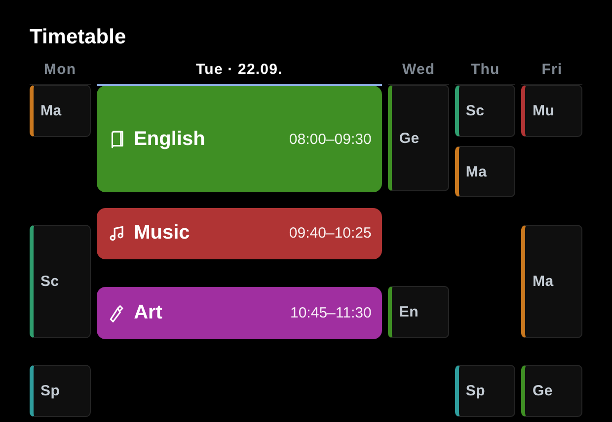

# MMM-SchoolWeek

A [MagicMirror²](https://magicmirror.builders/) module that shows a **weekly school
timetable**. The **active day** is rendered in full — colour blocks with a subject icon,
name and time, and breaks shown as real gaps on a proportional time axis. The **other
days** are compact and dimmed on the same shared time axis (double lessons stay proportional), so the whole week fits at a
glance.



## Features

- Active day full-size, time-proportional (breaks = real gaps), current lesson highlighted
- Other weekdays compact and dimmed on the same shared time axis (double lessons stay proportional)
- Built-in colour/icon map for common subjects, fully overridable per subject
- Optionally trim recurring "before/after school care" lessons at the day edges
- Self-contained styling; nothing hardcoded

## Installation

```bash
cd ~/MagicMirror/modules
git clone https://github.com/ago1776/MMM-SchoolWeek
```

Add to `config/config.js` (times are `"HHMM"`, `dayNumber` is 1 = Monday … 5 = Friday):

```js
{
  module: "MMM-SchoolWeek",
  position: "bottom_left",
  config: {
    title: "Timetable",
    schedule: [
      [1,"0800","0845","Math"],    [1,"0850","0935","German"],  [1,"0955","1040","Sport"],
      [2,"0800","0845","English"], [2,"0850","0935","Math"],    [2,"0955","1040","Music"],
      [3,"0800","0845","Science"], [3,"0850","0935","Art"],
      [4,"0800","0845","German"],  [4,"0850","0935","Math"],    [4,"0955","1040","Sport"],
      [5,"0800","0845","Math"],    [5,"0850","0935","German"],  [5,"0955","1040","Science"]
    ]
  }
}
```

## Configuration options

| Option             | Type   | Default                                   | Description                                                                 |
| ------------------ | ------ | ----------------------------------------- | --------------------------------------------------------------------------- |
| `title`            | string | `"Timetable"`                             | Header title.                                                               |
| `schedule`         | array  | `[]`                                      | Lessons: `[dayNumber(1-5), "HHMM", "HHMM", "Subject"]`.                      |
| `weekdayLabels`    | array  | `["","Mon","Tue","Wed","Thu","Fri"]`      | Column labels (index 1–5).                                                  |
| `locale`           | string | `null`                                    | Locale for the active-day date (e.g. `"en-GB"`); `null` = browser default.  |
| `showActiveDate`   | bool   | `true`                                    | Append the date to the active weekday header.                              |
| `gridHeight`       | number | `340`                                     | Height of the active-day time axis in px.                                  |
| `trimEdgeSubjects` | array  | `[]`                                      | Subject names to drop when they are the first/last lesson of a day.        |
| `subjects`         | object | `{}`                                      | Per-subject overrides: `{ "Math": { color:"#c9781f", abbr:"Ma", icon:"<svg-inner>" } }`. |

### Subject colours & icons

Unknown subjects get a generic icon and a 2-letter abbreviation. The built-in map covers
common subjects (math, languages, science, music, art, sport). Override any subject with
`subjects` — `icon` is the inner SVG markup (viewBox `0 0 24 24`).

## License

MIT © Andreas Göpfert

